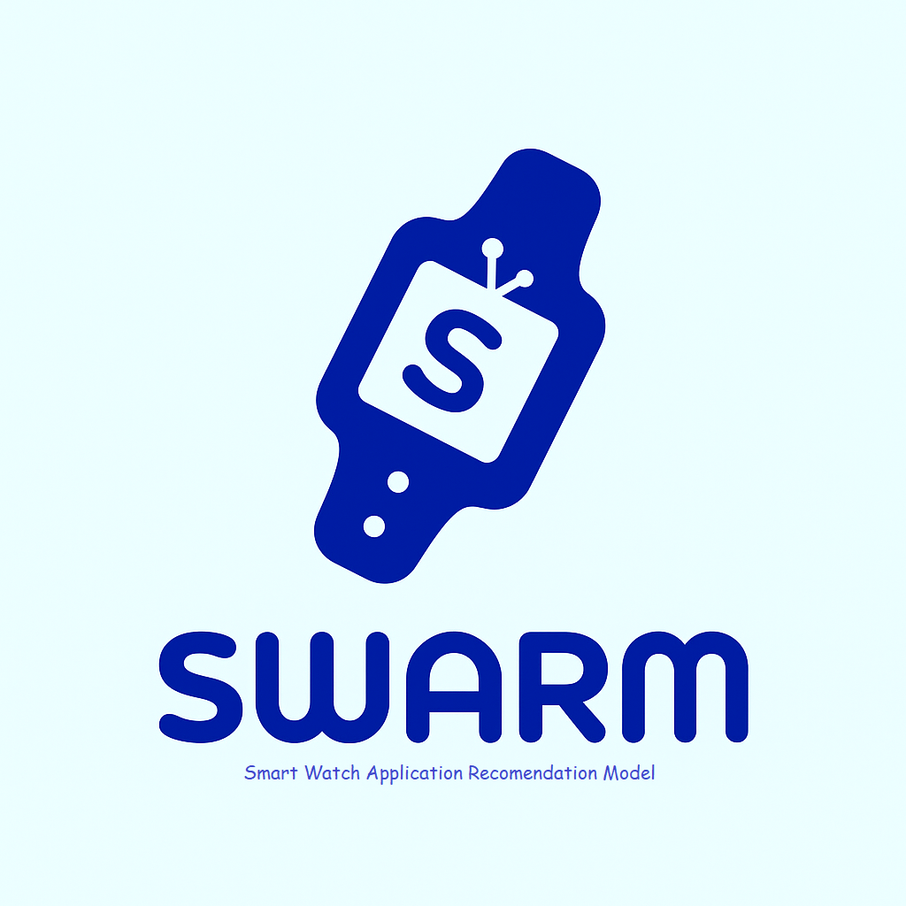

# SWARM - Smart Watch Application Recomendation Model

**SWARM**  adalah aplikasi yang dapat memberikan rekomendasi kepada pengguna untuk menentukan jenis Smart Watch / jam tangan yang paling cocok berdasarkan spesifikasi dan kebutuhan pelanggan. SWARM memerikan rekomendasi berdasarkan masukan teks yang diberikan pengguna dan membandingkan dengan reviews dari pembeli sebelumnya untuk menentukan produk yang paling sesuai dengan keinginan pelanggan.

---

## 📖 Problem Background 

Perkembangan teknologi telah melahirkan berbagai perangkat pintar yang dapat menunjang aktivitas harian, salah satunya adalah smartwatch. Perangkat ini tidak hanya berfungsi sebagai penunjuk waktu, tetapi juga dilengkapi fitur-fitur seperti penghitung langkah, pemantauan detak jantung, pelacakan tidur, dan pemantauan aktivitas olahraga. Sebuah studi yang diterbitkan dalam Journal of Medical Internet Research menyebutkan bahwa penggunaan smartwatch dapat meningkatkan kesadaran kesehatan pengguna dengan fitur-fitur yang ada.

Menurut Wikipedia(2025), terdapat lebih dari 50 brand elektronik/startup yang memproduksi berbagai jenis dan merk smart watch. Banyaknya merek dan jenis smartwatch di pasaran terutama di e-commerce membuat konsumen bingung untuk menentukan smartwatch yang sesuai. Terdapat banyak aspek seperti fitur, kualitas, rating pengguna, dan harga yang harus dipertimbangkan oleh pembeli sebelum menentukan smartwatch yang sesuai.
Oleh karena itu, dibutuhkan sebuah aplikasi yang dapat memberikan rekomendasi smartwatch berdasarkan kebutuhan dan preferensi pengguna, dengan mempertimbangkan spesifikasi dan harga yang ditawarkan.

## 🎯 Objective

Berdasarkan permasalahan yang terjadi, project ini memiliki beberapa tujuan antara lain:
- Membuat aplikasi yang dapat membantu pengguna untuk menentukan  jenis smartwatch yang sesuai dengan spesifikasi dan kebutuhan.
- Memberikan rekomendasi (top 3) device yang paling sesuai, beserta reviews produk berdasarkan pembelian sebelumnya.
- Memberikan rekomendasi kepada brand mengenai improvement produk yang dapat dilakukan berdasarkan hasil analisis sentimen pelanggan.
- Mengurangi biaya marketing dengan menekan cost per acquisition dan conversion lag

## 📦 Data

Dataset yang digunakan dalam project ini diperoleh dari hasil scraping pada sebuah website ecommerce dengan menggunakan kata kunci *"smart watch"*. Proses scraping menghasilkan dua buah dataset yaitu dataset produk dan dataset reviews.

Dataset produk terdiri dari 10 kolom dan 281 baris data.

| Index | Nama Kolom | Tipe Data |
| --- | --- | --- |
| 1 | Nama produk | String |
| 2 | Rating | Float | 
| 3 | Price | String |
| 4 | Features | String |
| 5 | Battery | Int |
| 6 | Connectivity | String |
| 7 | GPS | Boolean |
| 8 | Screen Size | Float |
| 9 | img_url | String |
| 10 | Brand | String |

Data set reviews terdiri dari 3 kolom dan 1104 baris data

| Index | Nama Kolom | Tipe Data |
| --- | --- | --- |
| 1 | Nama Produk | String |
| 2 | Reviews | String | 
| 3 | Rating | Float |

## ⚙️ Methods

Pada project ini terdapat beberapa proses pengolahan dan analisis data untuk mengembangkan sebuah model rekomendasi dan report analisis data berdasarkan objective yang ditentukan. Tahapan proses tersebut antara lain:

1. **ETL** : Proses Akuisisi Data
    ├── Scraping Data
    ├── Data Cleaning
    ├── Data Saving
    └── Data Testing (Great Expectation)

2. **Data Analysis** : Proses Analisis Data untuk membuat visualisasi dan mendapatkan insight
    ├── Data Exploration
    ├── Data Visualization
    └── Report

3. **Modelling** : Proses membuat model aplikasi rekomendasi smarwatch
    ├── Text Pre-processing
    ├── Data Transformation
    ├── Model Definition (Word2Vec)
    ├── Model Training (Cosine Similarity)
    ├── Model Deployment (Streamlit)
    └── Model Evaluation (USEQuesionnaire)

## 🛠️ Stack

Dalam pembuatan project ini terdapat beberapa tools atau library yang digunakan, yaitu:

| Programming Language |
| No | Tools |
| --- | --- |
| 1 | Python |
| 2 | SQL | 

## 🚀 Result

